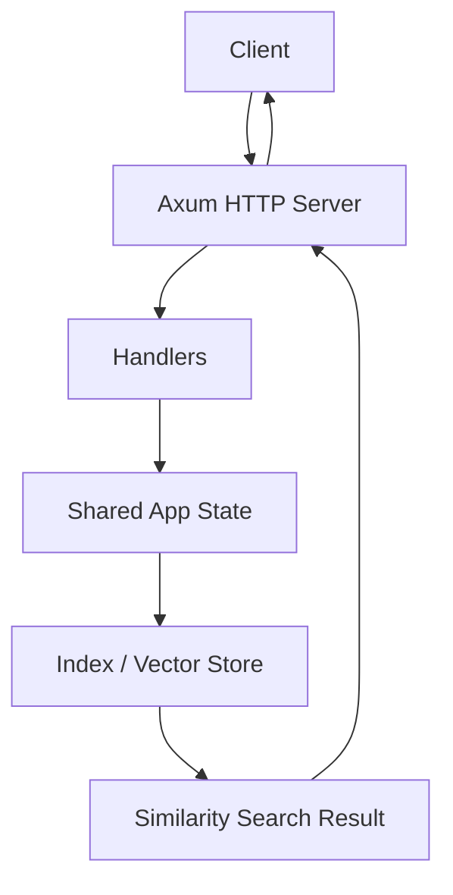
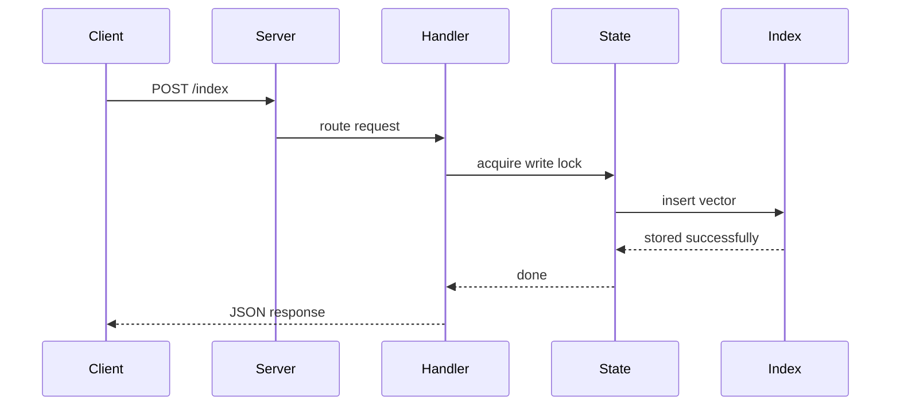
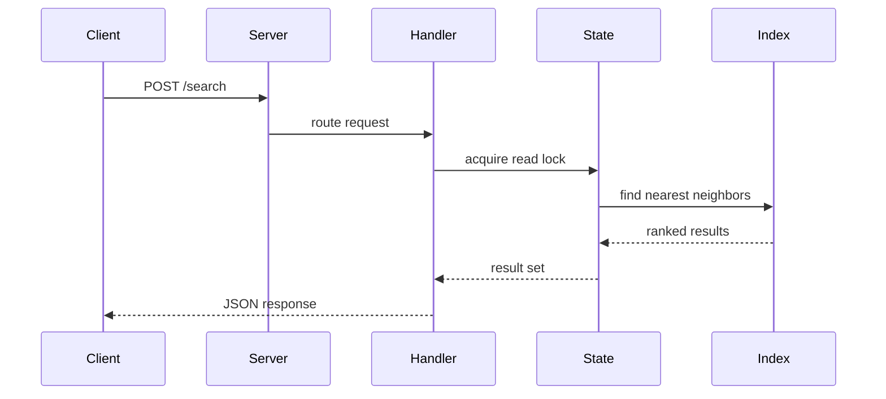

# semantic-search

A small Rust service that demonstrates semantic search with an in-memory HNSW-style graph and an Axum HTTP API.

## What it does

- Accepts vectors with an identifier via `POST /index`
- Searches for the nearest neighbors via `POST /search`
- Uses a shared `RwLock` so many reads can happen at once while writes stay exclusive

## Simple flow diagram



## Step-by-step flow

1. The client sends a request to the server.
2. The Axum router routes the request to the correct handler.
3. The handler reads or writes through the shared app state.
4. The index stores vectors or searches for similar ones.
5. The result is returned as JSON to the client.

## Project layout

The code is split into small, readable modules:

- `src/models.rs` — request and response payloads
- `src/index.rs` — the in-memory vector index and similarity logic
- `src/state.rs` — shared application state with the `RwLock`-protected index
- `src/handlers.rs` — HTTP handlers for `/health`, `/index`, and `/search`
- `src/app.rs` — router assembly and server startup

## Request lifecycle





## Run it

```bash
cargo run
```

Then try:

```bash
curl http://localhost:3000/health
curl -X POST http://localhost:3000/index \
  -H 'Content-Type: application/json' \
  -d '{"id":"doc_1","vector":[0.1,0.8,0.2]}'

curl -X POST http://localhost:3000/search \
  -H 'Content-Type: application/json' \
  -d '{"query":[0.12,0.79,0.18],"top_k":3}'
```
